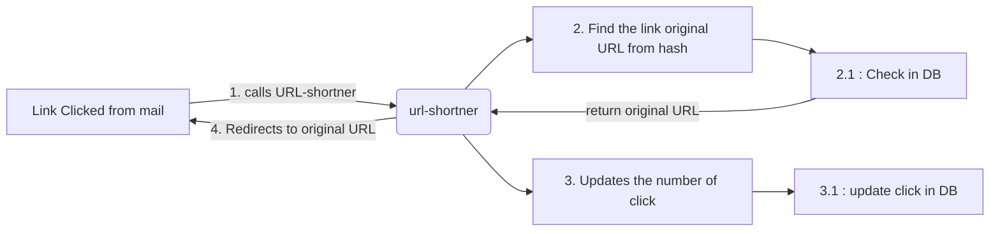

# Welcome to URL SHORT-NER!

## About
Hi! This project is created for shortening URLs generated in sorted systems. This projects handles the task for redirecting from a short url to original URL
> The project is created with Node JS v18.17.1 (npm v9.6.7)

## How to Run
|command  | pourpose |
|--|--|
|npm start  | runs with nodemon |
|node index.js|runs with node |

#### Author
- Prakhar Verma